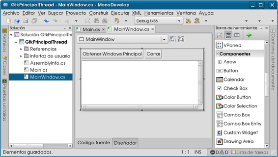
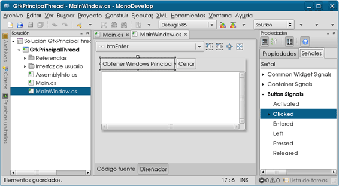
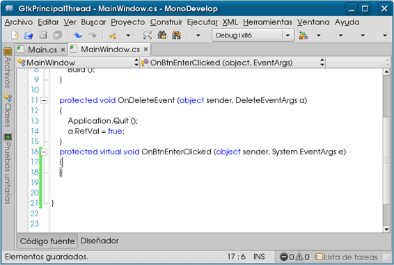
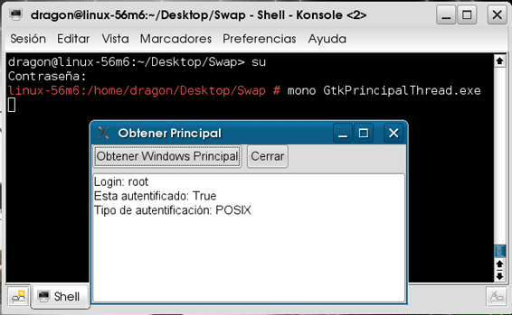

# Utilizando la clase WindowsPrincipal con MonoDevelop

En este post Conceptos Básicos de seguridad en .NET (parte II) muestro un par de programas ejemplificando acerca de la utilización de la clase WindowsPrincipal. Esta clase representa la información de autenticación y de autorización de una entidad dentro del sistema.

Estos ejemplos pueden compilarse y ejecutarse en Linux, en este caso lo hice en un sistema operativo OpenSuse versión 11.1, con el compilador 2.6.7 y el runtime de mono versión 2.6.7, como se muestra en la siguiente imagen:

El primero de los dos ejemplos lo compilamos y lo ejecutamos mostrando el resultado como en la siguiente imagen:

En la siguiente imagen mostramos el resultado si lo ejecutamos como el superusuario root.

En el caso del segundo ejemplo modificamos el código y cambiamos la interfaz de consola por una interfaz gráfica utilizando el diseñador GTK# de MonoDevelop, siguiendo los siguientes pasos:

1.Creamos una solución con un proyecto GTK# 2.0 en Monodevelop como en la siguiente imagen:

2.Modificamos la apariencia del formulario, agregamos dos botones btnEnter, btnClose y un textview nombrado txtInfo para que el formulario se vea como en la siguiente imagen:

3.Agregamos el método para el evento Clicked del botón btnEnterutilizando la pestaña señales en la ventana de propiedades, seleccionamos el evento y hacemos doble click para que MonoDevelop genere el código del método, como se muestra en las siguientes imagenes:

4.Agregamos las siguientes líneas al inicio del código de la clase MainWindow.cs , para utilizar los miembros de los ensamblados 
System.Security.Principal y System.Threading respectivamente.

<pre>
using System.Security.Principal;
using System.Threading;
</pre>

5.Dentro del método OnBtnEnterClicked del código generado por MonoDevelop para el evento del botón btnEnter, escribimos el siguiente código, el cual contiene toda la funcionalidad de nuestro programa:

Nuestro programa entonces se vera como en la siguiente imagen:

6.Ahora creamos el código del evento Clicked para el botón btnClose de la misma forma que lo hicimos para el botón btnEnter, cuya acción será terminar el programa, por lo que escribimos el siguiente código dentro del método generado.

<pre>
protected virtual void OnBtnCloseClicked (object sender, System.EventArgs e)
{
Application.Quit();
}
</pre>

7.Para compilar el programa hacemos click en el submenú Construir todo debajo del la opción Construir en el menú principal. En caso de ejecutar el programa hacemos click en cualquiera de las opciones Ejecutar o Depurar bajo el menú Ejecutar en el menú principal.

8.Si el programa se compila correctamente al ejecutarse mostrará el resultado como en la siguiente imagen:

9.Si ejecutamos el programa desde la terminal como superusuario nos mostrará el resultado como en la siguiente imagen:

Vemos en el resultado de la ejecucción que el metódo de autenticación es POSIX.

